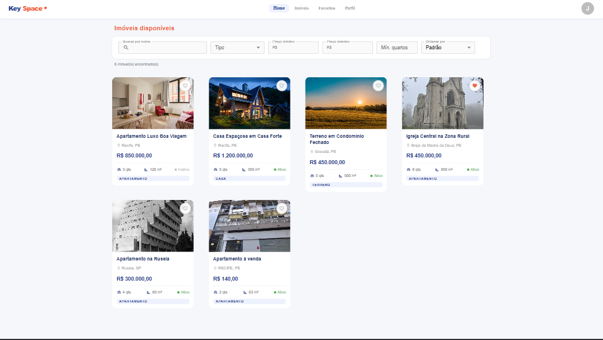
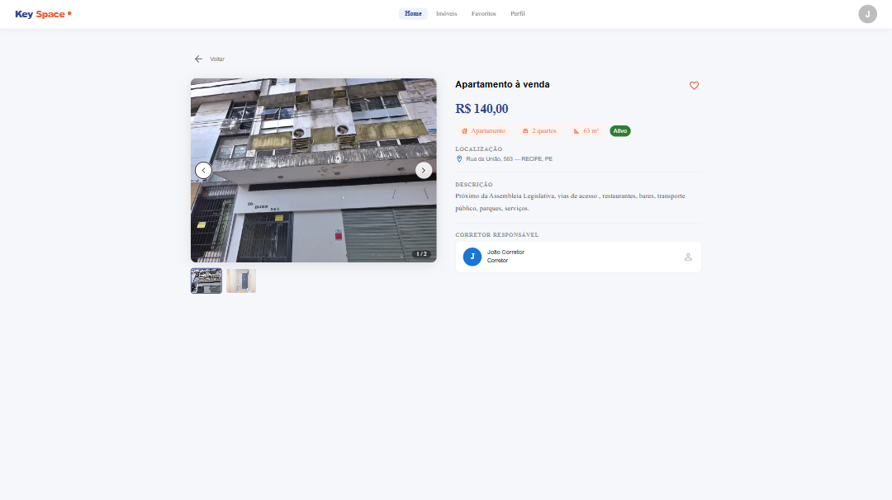
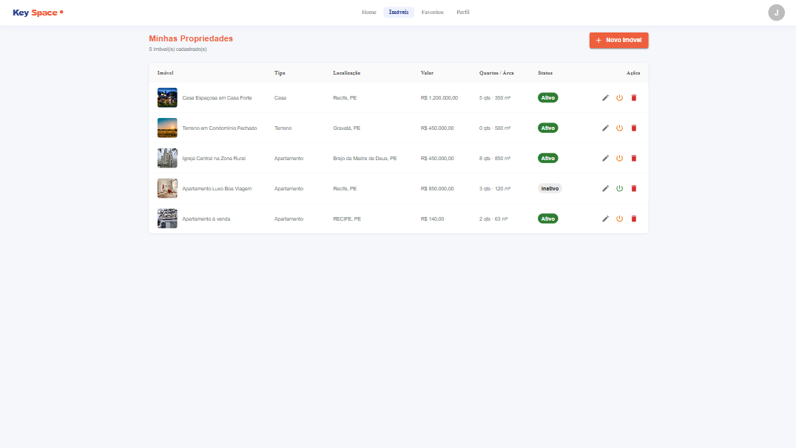

# 🏠 KeySpace App (Portal Imobiliário)

Aplicação front-end desenvolvida em React que simula um portal imobiliário completo.
O sistema permite que usuários visualizem, filtrem e favoritem imóveis, além de oferecer uma área autenticada para gerenciamento de propriedades por corretores e administradores.

---

## 📸 Preview

Interface da aplicação em diferentes fluxos:






---

## ⚙️ Funcionalidades

### 🔓 Área Pública

- Listagem de imóveis com paginação
- Filtros por:
  - Nome
  - Tipo
  - Faixa de preço
  - Quantidade de quartos

- Busca com debounce
- Sincronização de filtros com URL (query params)
- Visualização detalhada de imóveis

---

### 🔐 Área Autenticada

- Login e registro com JWT
- Persistência de autenticação
- Proteção de rotas privadas
- Atualização de perfil (nome e senha)
- Favoritar e desfavoritar imóveis
- Listagem de imóveis favoritos

---

### 🧑‍💼 Área do Corretor / Admin

- Listagem de propriedades do usuário
- Criação de novas propriedades
- Edição de propriedades existentes
- Exclusão de propriedades
- Alteração de status (ativo/inativo)
- Upload de imagens via Cloudinary

---

## 🧱 Arquitetura e Decisões Técnicas

O projeto foi estruturado seguindo boas práticas de organização e separação de responsabilidades:

- **Componentização**: separação entre componentes reutilizáveis e páginas
- **Hooks customizados**: lógica isolada em hooks como:
  - `useProperties`
  - `useFavorites`
  - `useProfile`
  - `useMyProperty`

- **Service Layer**:
  - Centralização das chamadas HTTP (API)

- **Gerenciamento de estado assíncrono**:
  - React Query para cache, refetch e controle de loading/error

---


## 🛠️ Tecnologias Utilizadas

- **React**
  Construção da interface com foco em componentização e reusabilidade.

- **TypeScript**
  Tipagem estática para maior segurança, previsibilidade e escalabilidade do código.

- **React Router**
  Gerenciamento de rotas SPA com suporte a rotas privadas.

- **React Query**
  Escolhido para gerenciar estado assíncrono e cache de dados da API, evitando a necessidade de soluções mais complexas como Redux.

- **Axios**
  Cliente HTTP com suporte a interceptors, facilitando tratamento de autenticação e erros globais.

- **Cloudinary**
  Utilizado para upload e armazenamento de imagens na nuvem, evitando sobrecarga no backend.

- **Material UI (MUI)**
  Biblioteca de componentes para acelerar o desenvolvimento e garantir consistência visual.

- **React Hook Form**
  Gerenciamento eficiente de formulários com foco em performance, reduzindo re-renderizações e simplificando o controle de estado.

- **ZOD**
  Validação de dados baseada em schemas, garantindo consistência, integração com TypeScript e maior confiabilidade nas entradas do usuário.

---

## 🧠 Possíveis melhorias futuras

- Implementação de testes (Jest / Cypress)
- Internacionalização (i18n)
- Paginação infinita (infinite scroll)
- Melhorias de performance com memoização
- Controle de permissões mais granular (RBAC)

---

## ▶️ Como rodar o projeto

```bash
# Clonar repositório
git clone https://github.com/santos42jv/engeman-desafio-joaosantos.git

# Instalar dependências
npm install

# Rodar o projeto
npm run dev
```

---

## 🔐 Usuários para teste

Você pode utilizar os seguintes usuários fornecidos pela API:

### 👑 Admin

- Email: admin@imobiliaria.com
- Senha: 123456

### 🧑‍💼 Corretor

- Email: corretor@imobiliaria.com
- Senha: 123456

### 👤 Cliente

- Email: cliente@gmail.com
- Senha: 123456

---

## 👨‍💻 Autor

Desenvolvido por João Santos

- GitHub: https://github.com/santos42jv
- LinkedIn: https://www.linkedin.com/in/santosjoaov/

---

## 📄 Licença

Este projeto foi desenvolvido para fins de estudo e avaliação técnica.
